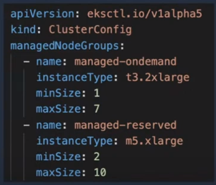
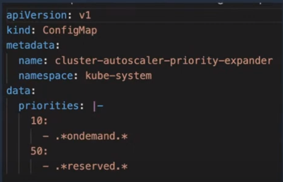
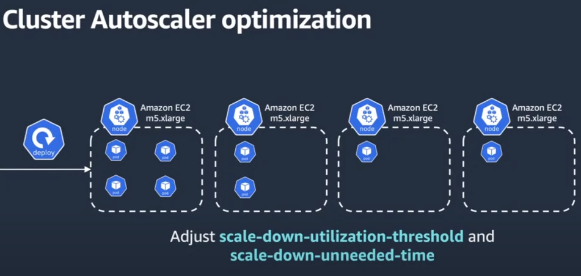
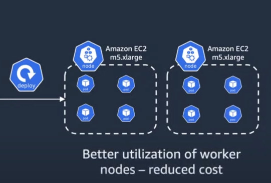
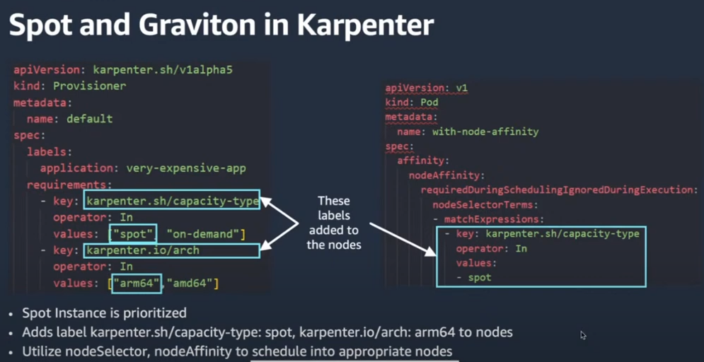
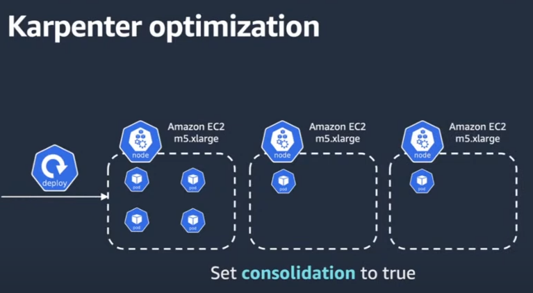
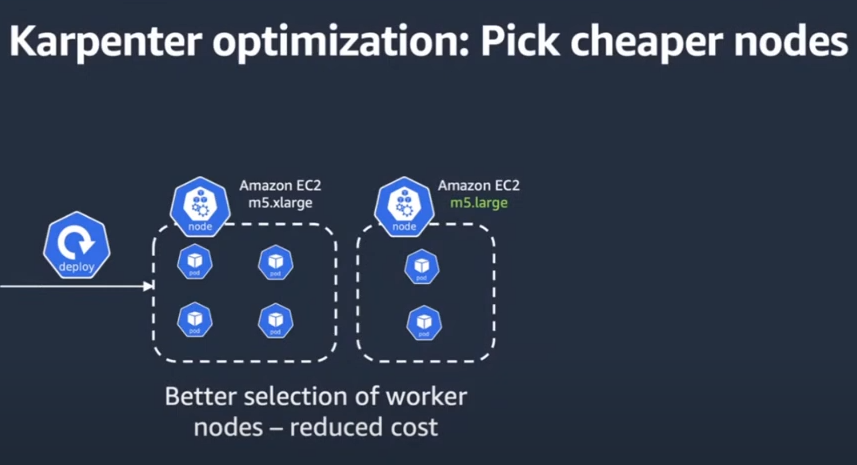
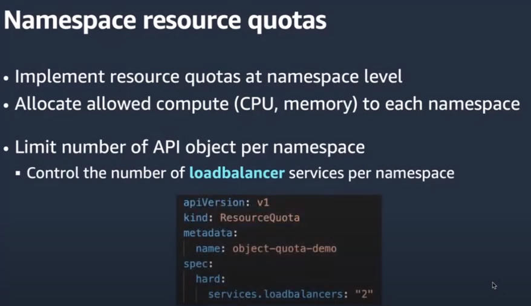
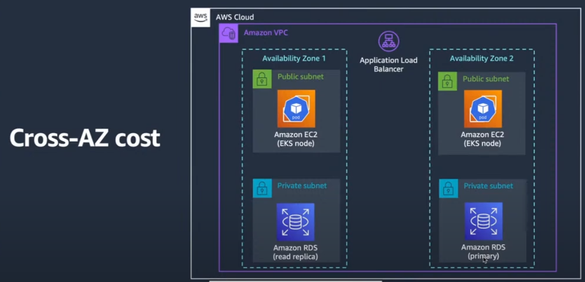

# Future-proof your K8s cluster for cost optimization

## Agenda
- why k8s cost optimization is necessary
- breaking down EKS costs
- techniques
- Q&A

## Facts
- 68% orgs reported increase ub cost - CNCF survey

## Breaking it down
- Control plane (fixed cost)
- Data plane (variable cost)
    - workload
        - pods
            - CPU (node/fargate)
            - memory (node/fargate)
        - auto scaling
    - network
        - pod data transfer
        - ECR
        - ELB
        - NAT
    - observability
        - logging
        - monitoring

## Main target area (workload)
- 70 % of the cost lie in the workload
- sneaky network costs can be contained by best practices
- Datadog stats
    - 30% or less CPU is used by 49% of containers
    - 30% or less memory is used by 45% of containers

## Dilemma (workload)
- how much CPU or memory can we allocate, including max limits
- well, `if you can't measure it, you can't manage it` by Peter Drucker

## Solution for Pods (workload)
- use cost tools
- Amazon EKS cost monitoring plugins: Kubecost

## Solution for Nodes (workload)
- AWS offers spot & AWS Graviton
- spot instances provide up to 90% discout over on-demand instances
- Graviton processors are custom-built with 64-bit Arm processor cores
- if you are using a M1 or M2 macbook, tou are using Arm processor
- Graviton provides up to 40% better price performance over x86_64 instances
- one thing to keep in mind while using Graviton is you always want to build multi-architecture image meaning you run your container either in Graviton or in x86 instances
- there are 2 types of processors mainly
- x86_64 by Intel & ARM
- ARM provides licenses to any company to customize and build their ARM processors
- AWS's ARM processor is Graviton
- so EKS has support for Graviton
- where do you integrate Gravitons
    - 3 options
        - cluster auto-scaler
            - 
            - 
            - 
            - 
            - 
        - karpenter
            - 
            - 
            - 
        - fargate (serverless way of running containers)
            - use CloudWatch container insights for Fargate. Fargate does not support KubeCost because fargate does not support daemonset

## 2nd target area (network)
- 