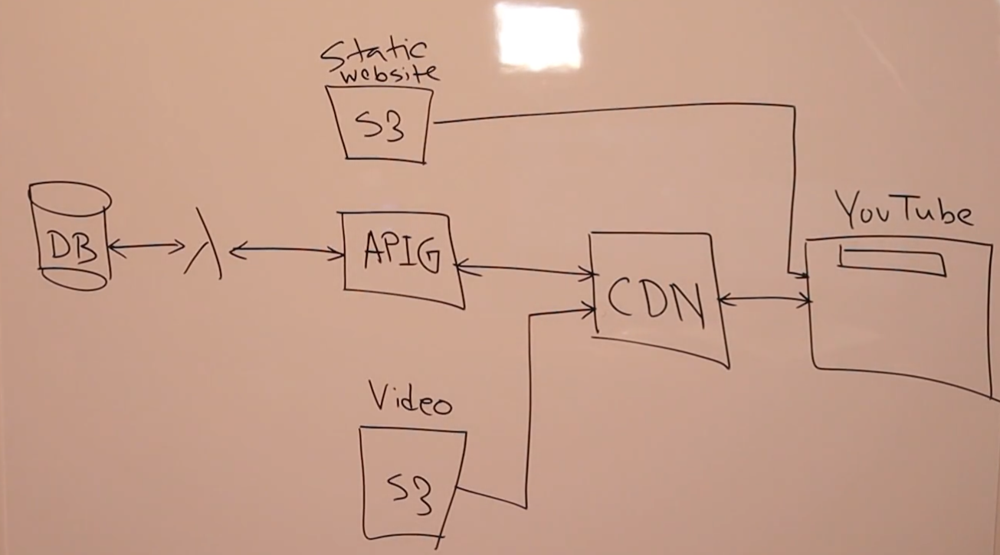
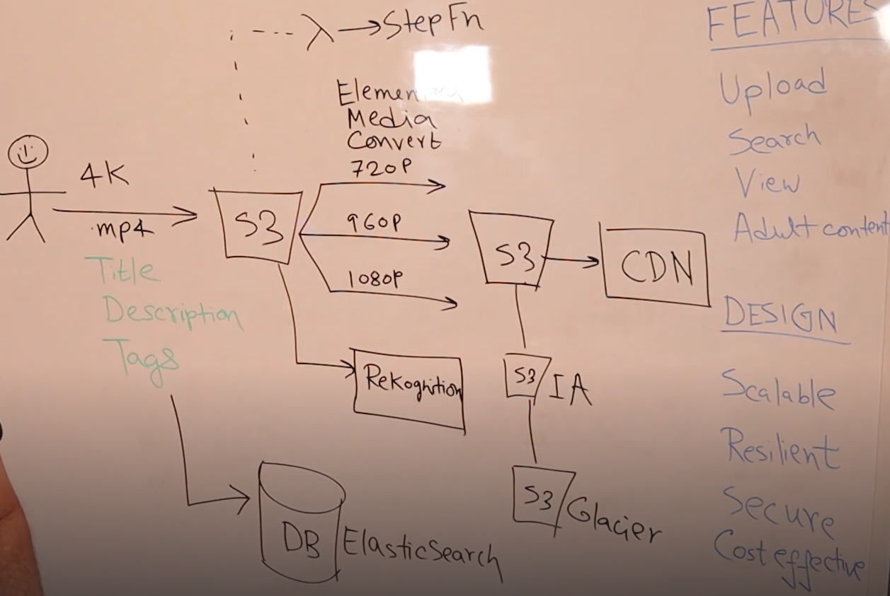

# We are designing modern app in AWS

## MUST know
- design is devided into 4 core components.
- mastering the 5 MUST-knows will help answer the Qs which you are not prepared for.
- 1st system design component you must absolutely know is `Microservices`
    - Load Balancer V API Gateway. If you are using LB, interviewer will prob you about APIG and vice-versa
    - Sync V Async patterns
- 2nd is Database selection
    - SQL V NoSQL
- 3rd is Caching
    - Database & CDN
- 4th is Security (this will separate you from other candidates)
    - AuthN/Z, Encryption at rest & transit
- 5th is Scalable & Available

## Design YouTube/Netflix/Prome video
### Upload
- Requirements: Upload, Search, View, Filter adult content, Sacalable, Resilient, Secure, Cost at effective
- Requirements: videos are 4K resolution, format is .mp4, goes to a storage with Title, Description, Tags
- When we say storage, first thing that comes to mind is harddisc or elastic blog storage in AWS. Which is not good for the solution because you cannot easily attach a harddisc and if you want then you will have to attach another harddisc and if a file got split between harddisc, you will have to manage that splitting and partitioning stuff.
- You have to implement resiliency. If the attached harddic fails, restore from back up and not data is lost
- Also unused data space
- So we use S3.
- Tile, Description, Tags should be stored in DB because we will have to search
- If heavy traffic, do not use Relational DB
- Bcoz, RDBMS cannot horizontally scale
- RDBMS can scale vertically only
- DB should be optimized for searching text
- So we will use a NoSQL DB called ElasticSearch to store the metadata
- 4K resolution has to be converted to diff resolutions to be consumed by diff devices
- encoding happens in all available resolutions
- we use Elemental Media Convert
- For adult content, we will user Amazon Rekognition. It is an AI/ML service
- All these need to happen parallely.
- So we will use Step Fn
### Search
- S3 is changed based on how many times the files are accessed.
- We place a CDN in front of S3
- You will be probed here S3<->CDN
- 
- Problem with mp4 is you cannot fragment it into chunks. It just download the whole mp4 file and then you start viewing.
- Encoded videos are stored in HLS format (HTTP live streaming)
- HLS format breaks into chunks
- Interviewer may ask how will you cut cost even more
- S3 has many tiers
- If some videos are infrequently accessed, we move from standard to IA (Infrequent Access). You can set lifecycle policies saying after 30 days move the videos to IA and then to Glacier. Now a days we can retrieve from Glacier within hours.
- 
### Security
- 2 types of security: data & access
- security of data in transit & rest
- watch security lecture for details (cognito, Active Directory Provider)
- ElasticSearch, S3, CDN can be secured by encryption at rest by KMS
