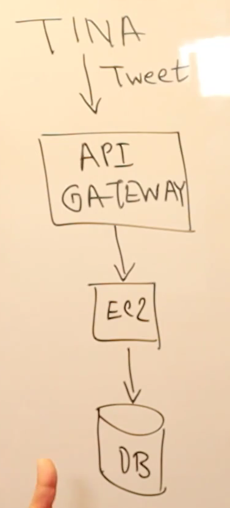
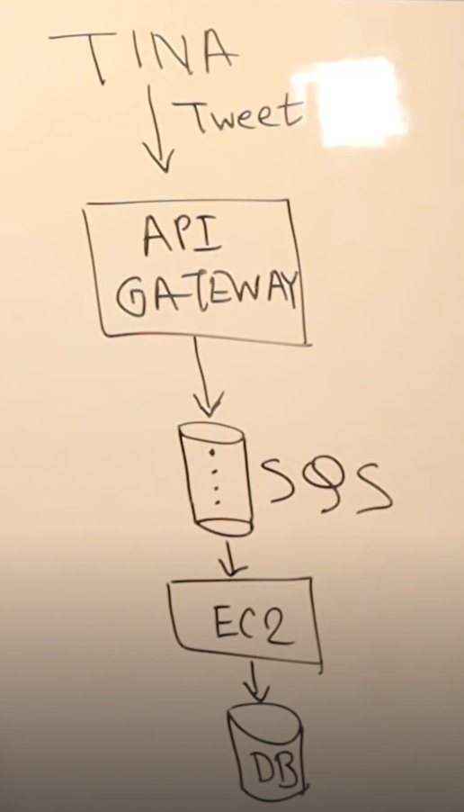
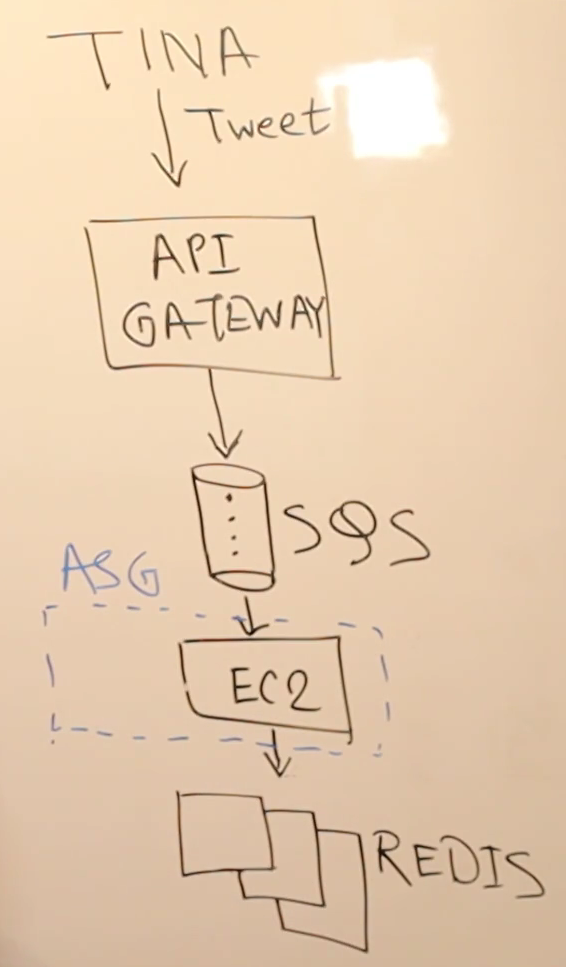
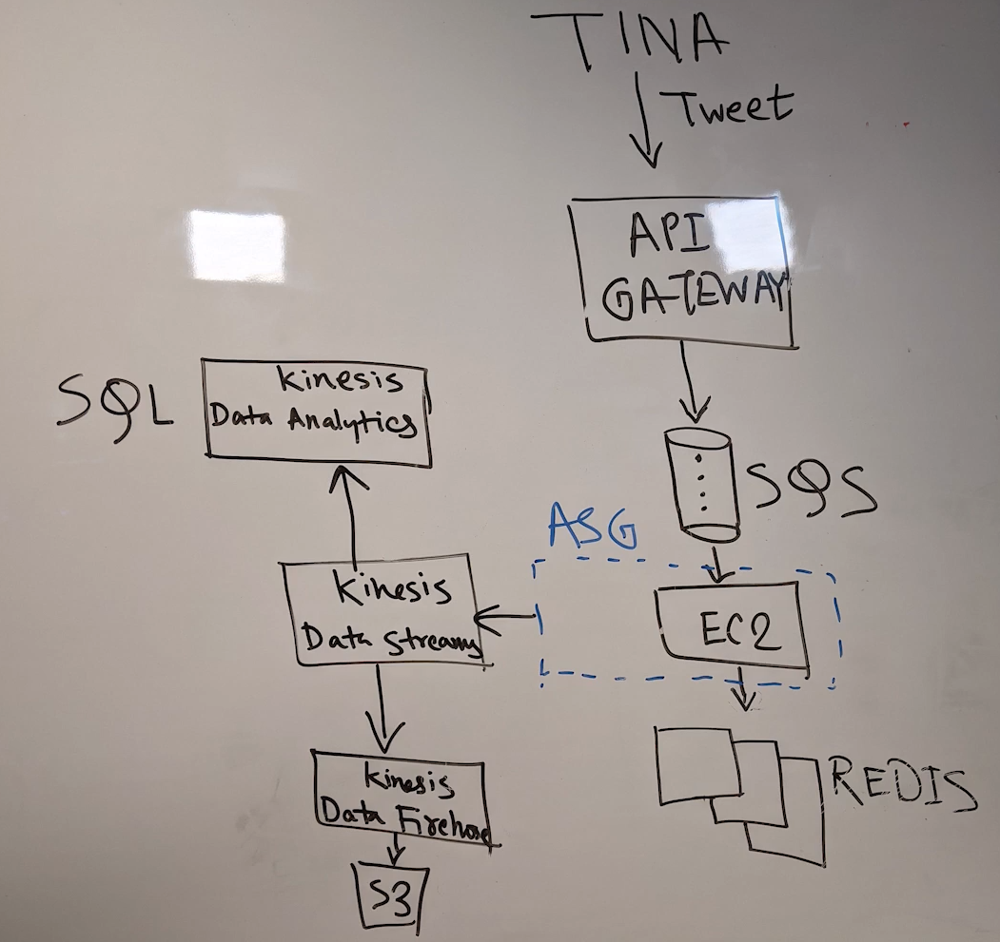
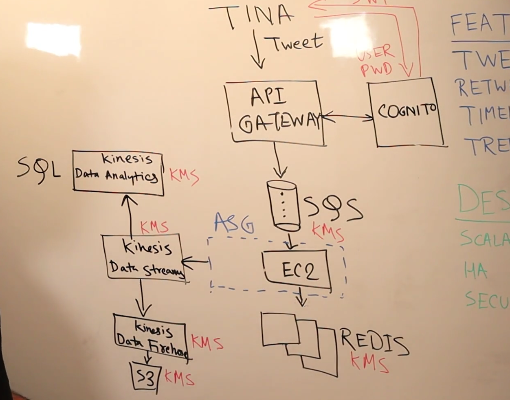

# Design Tweeter
We are designing an application like TWEETER in AWS

## Design Considerations
|FEATURE|DESIGN|
|-------|------|
|TWEET | SCALABLE|
|RETWEET|HA|
|TIMELINE|SECURE|
|TRENDING||

### Tables
|Person|Follower|
|------|--------|
|Tina|Bob|
|Tina|Joe|
|Tina|Mike|
|Bob|Kim|

|Person|Tweet|Datetime|
|------|-----|--------|
|Tina|I love cake|01/01/2024 23:23:23|

## What things matters
- read heavy application
- as soon as Tina tweets, it checks which followers of Tina are active and then it creates timelines only for them
- This won't work because for traffic spikes, every component has to scale

- Above is a synchronous design
- There is no re-try built-in
- Async design works here

- EC2 can be in ASG and thus it can scale b ased on the traffic
- Redis a caches DB is very fast for reads

- 3 copies of the table
- Disadvantage of Redis is that it is fast but expensive
- What can replace Redis?
- You need a DB that can scale, fast response, cost effective
- DynamoDB (millisec response, scales and is pay as you go)
- If we need even faster response in microsec, we can use DAX
- Tweeter pre-computes the timelines for users who have less followers
- If a user logs in, it sees what is precompute
- if he follows someone famous, their tweets are added later

## TRENDING
- 

## SECURITY
- AuthN/Z
    - Tina is a registered user in Cognito.
    - When Tina logs in, Tina sends user/pass and Cognito gives back a auth token (JWT).
    - When Tina uses the API, she passes the JWT in the header
    - Then API Gateway validates with Cognito
- DATA at rest is encrypted by using KMS

- DATA at transit is encrypted by HTTPS or TLS
- APIG supports mutual TLS. Not only client but server also can authenticate