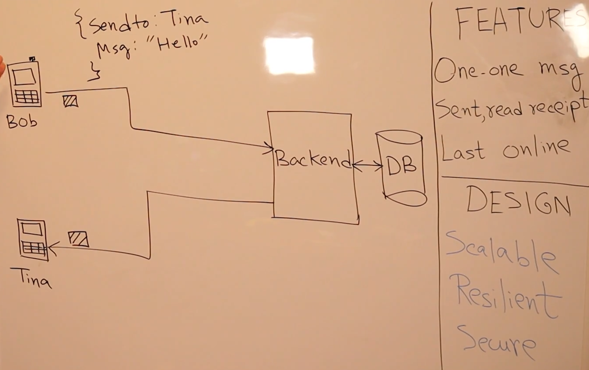
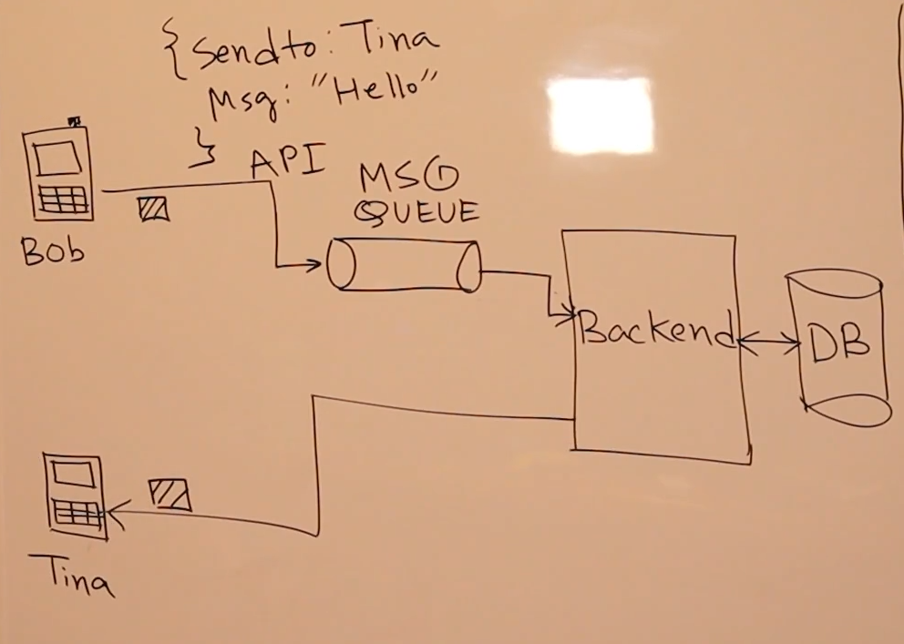

# Design chats

## Never jump but mention the features
`Always do the requirement gathering first. We will do 3 features - messages, sent read receipt, last online. Design should be scalable, resilient, & secure.
`

`The problem with synchronous way is that everything needs to scale together and if a message fails to deliver, there is no retry other than the user.
`

`So how does server send message to client. It is done by websocket API. SQS is scalable as it scale infinitely & it is resilient as it replicates to 3 different AZs. DLQ for re-processing. What about ordering? Sometimes you see the messages in Whatsapp are out of order. If you want you can use FIFO SQS but it is not as scalable as standard SQS. So you will need more number of queuees. What if intervr says I don't want to pay for idle cost. You can say Lambda.For the database, DynamoDb is pretty fast, pay as you go and scalable.
`